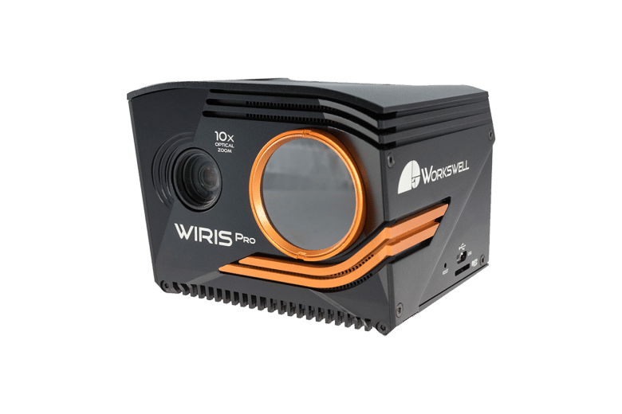

<a name="readme-top"></a>

<!-- PROJECT LOGO -->
<br />
<div align="center">
  <a href="https://github.com/miggilcas/wirispro_manager_panel/tree/ethGui-WIRIS">
    
  </a>
  <a href="https://github.com/miggilcas/wirispro_manager_panel/tree/ethGui-WIRIS">
    
  </a>

  <h3 align="center">Wiris Pro Manager RViz Panel</h3>

  <p align="center">
    An awesome RViz panel plugin for WirisPro Camera control
    <br />
    <a href="https://github.com/miggilcas/wirispro_manager_panel/tree/ethGui-WIRIS"><strong>Explore the docs »</strong></a>
    <br />
    <br />
    <a href="https://github.com/miggilcas/wirispro_manager_panel/issues/new?labels=bug&template=bug-report---.md">Report Bug</a>
    ·
    <a href="https://github.com/miggilcas/wirispro_manager_panel/issues/new?labels=enhancement&template=feature-request---.md">Request Feature</a>
  </p>
</div>


<!-- TABLE OF CONTENTS 
<details>
  <summary>Table of Contents</summary>
  <ol>
    <li>
      <a href="#about-the-project">About The Project</a>
      <ul>
        <li><a href="#built-with">Built With</a></li>
      </ul>
    </li>
    <li>
      <a href="#getting-started">Getting Started</a>
      <ul>
        <li><a href="#prerequisites">Prerequisites</a></li>
        <li><a href="#installation">Installation</a></li>
      </ul>
    </li>
    <li><a href="#usage">Usage</a></li>
    <li><a href="#roadmap">Roadmap</a></li>
    <li><a href="#contributing">Contributing</a></li>
    <li><a href="#license">License</a></li>
    <li><a href="#contact">Contact</a></li>
    <li><a href="#acknowledgments">Acknowledgments</a></li>
  </ol>
</details>
-->

## Overview


This package provides a custom RViz panel for managing the Workswell Wiris Pro camera in the context of SIMAR project. The panel allows users to make a simple use of the camera features, such as start/stop recording video, capture images, enable the ethernet video Stream, Zoom Adjustement, etc; using as a driver package in ROS as a backend. 

<!--TBD: include a GIF of the whole thing working -->

## Features

- **Video Start/Stop Controls:** Start Recording, Stop recording
- **Zoom Adjustment:** Change the Zoom of the WirisPro Camera, from -10x to 10x.
- **Gimbal Control:** Change the Gimbal mode from follow to locked or viceversa and the roll, pitch and yaw angles.
- **Streaming activation:** Enable the Ethernet streaming in the Camera
- **Streaming visualization:** Streaming visualization in a 640x480 resolution window, visible and thermal views can be switched

## Dependencies installation

---

### Build essentials and cmake
```bash
sudo apt-get install build-essential cmake
```

### Qt5
```bash
sudo apt-get install qt5-default
```

### Build OpenCV from source  following the steps indicated in [mediamtx](https://github.com/bluenviron/mediamtx?tab=readme-ov-file#opencv) repo
OpenCV can publish to the server through its GStreamer plugin, as a RTSP client. It must be compiled with GStreamer support, by following this procedure:

```bash
sudo apt install -y libgstreamer1.0-dev libgstreamer-plugins-base1.0-dev gstreamer1.0-plugins-ugly gstreamer1.0-rtsp python3-dev python3-numpy
git clone --depth=1 -b 4.2.0 https://github.com/opencv/opencv # we use this version because cv_bridge ros package in noetic use that version, if not you could face incompatibility problems
cd opencv
mkdir build && cd build
cmake -D CMAKE_INSTALL_PREFIX=/usr -D WITH_GSTREAMER=ON ..
make -j$(nproc)
sudo make install
```
### ROS (Robot Operative System)

Follow up your ROS distro installation guide: [Melodic](http://wiki.ros.org/melodic/Installation/Ubuntu) or [Noetic](http://wiki.ros.org/noetic/Installation/Ubuntu)


### ROS Gremsy Gimbal Interface
Follow up the repository Setup instructions:
[ROS Gremsy repo](https://github.com/alemuva2001/ros_gremsy)


## Usage

1. Clone this repository into your ROS workspace and compile it using cmake:
    ```bash
    mkdir -p your_ros_ws/src && your_ros_ws/src && git clone https://github.com/...

    cd .. && catkin_make
    ```

1. Source the workspace and launch RViz:

    ```bash
    source devel/setup.zsh && rviz

    # just in case you don't know about zsh and you use bash :(
    source devel/setup.zsh && rviz
    ```

2. Add the custom panel to your RViz layout:

    - Click on the "Panels" tab in RViz.
    - Select "Add New Panel" and choose it from the list.

...

Define more steps to follow

## Help / Contribution

* Contact: **Miguel Gil Castilla** (mgil8@us.es)


* Found a bug? Create an ISSUE!

* Do you want to contribute? Create a PULL-REQUEST!

<br />
<div align="center">
  <a href="https://github.com/miggilcas/wirispro_manager_panel/tree/ethGui-WIRIS">
    
  </a>

  
</div>

<!-- ACKNOWLEDGMENTS -->
## Acknowledgments

Finally I want to thank the following packages or URLs that inspired us to create the plugin.

* [Rosbag RViz Panel](https://github.com/catec/rosbag_rviz_panel)
* [Ethernet Stream SDK GUI 1.0.0](https://github.com/SoftwareWorkswell/EthernetStreamSDKGUI)
* [TeleopPanel Tutorial](https://docs.ros.org/en/melodic/api/rviz_plugin_tutorials/html/panel_plugin_tutorial.html)
* [MEDIAMTX](https://github.com/bluenviron/mediamtx)


---
---

